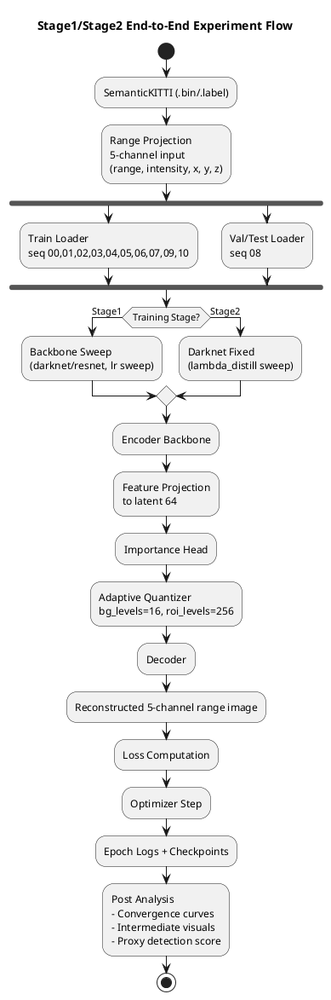
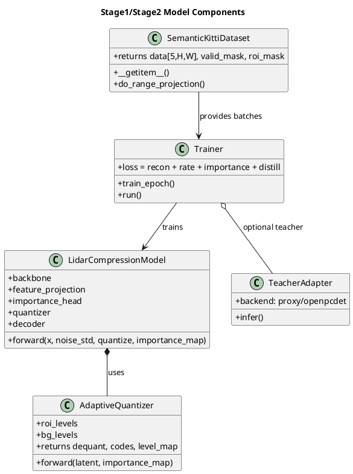
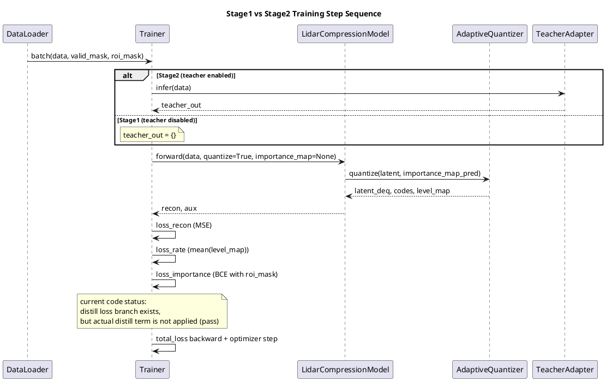
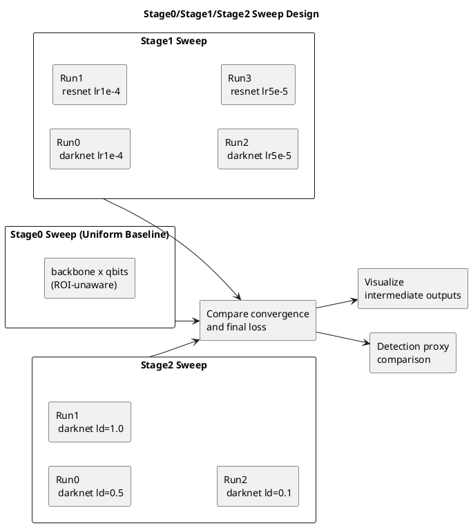

# Stage1/Stage2 UML and Flow Diagrams (PlantUML)

이 문서는 논문/교수님 공유용으로 Stage1, Stage2 실험 흐름을 PlantUML 문법으로 정리한 자료입니다.

## 1) End-to-End Experiment Flow

## 2) Model Component Diagram

## 3) Training Step Sequence (Stage1 vs Stage2)

## 4) Experiment Sweep Structure

## 5) Figure Mapping for Slides/Thesis

- Figure A: End-to-End Experiment Flow
- Figure B: Model Component Diagram
- Figure C: Stage1 vs Stage2 Training Sequence
- Figure D: Stage0/1/2 Sweep Design Matrix

위 4개를 먼저 넣고, 다음으로 노트북에서 생성한 정량 그래프(loss curve, final loss bar, intermediate panel)를 연결하면 발표 자료 구조가 깔끔합니다.
